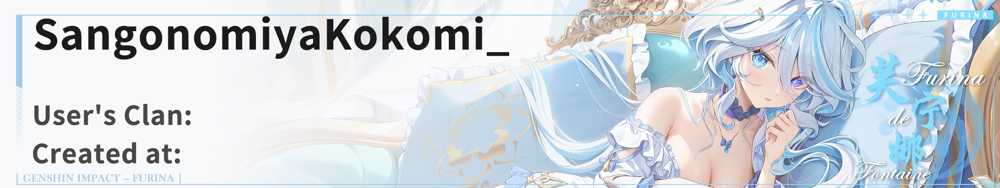

# Kokomi_bot 部署教程 (V 5.0.0+)

> 当前教程为 v5 版本，如需查看 v4 版本的教程，请点击[此处](https://github.com/SangonomiyaKoko/Kokomi_Bot/blob/main/README_OLD.md)

## **V5 版本 bot 尚在开发中，请耐性等待**

预计上线时间：暑假之前

## 🔧 V5 优化内容

1. **架构升级**：后端采用分布式 + 微服务架构，大幅提升并发处理能力
2. **多语言支持**：新增日语和英文版本，覆盖更广泛用户群
3. **主题切换**：新增日间模式与夜间模式，满足不同场景需求
4. **指令系统重构**：全面重做指令集，优化指令匹配逻辑，响应更精准
5. **文档优化**：每条指令配套独立帮助文档，使用更清晰
6. **图片主题可选**：支持多种图片风格自由切换
7. **用户别名功能**：新增用户别名表，便捷查找他人数据

## 🛠️ 搭建教程

### 环境配置

```bash
# 强烈推荐通过 git clone 的方式下载项目，方便后续使用 git 拉取更新
git clone https://github.com/SangonomiyaKoko/Kokomi_Bot.git  # 下载项目代码

cd Kokomi_Bot  # 进入项目目录

python -m venv .venv  # 创建 Python 虚拟环境

# 激活虚拟环境（根据你的操作系统选择下列命令）
.venv/Scripts/activate       # Windows
source .venv/bin/activate    # Linux / macOS

# 安装开发所需的 Python 依赖库
pip install -r requirements-dev.txt
```

📌 **提示：**  
如果使用了虚拟环境，请确保后续的依赖安装、项目运行等操作都在该环境中进行。

如果你是编程新手，不使用虚拟环境也是可以的，但推荐使用以避免依赖冲突。

---

### 配置 `config.yaml`

项目目录中包含一个配置示例文件：  
`app/config.yaml.example`，请复制该文件并重命名为：  
`config.yaml`

```yaml
API:
  API_URL: "http://127.0.0.1:8080" # 后端接口地址
  API_TYPE: "REST" # 接口类型
  API_USERNAME: "user" # 接口用户名
  API_PASSWORD: "password" # 接口密码
  REQUEST_TIMEOUT: 10 # 接口请求超时时间（秒）

BOT:
  PLATFORM: "KokomiBot-Bate" # Bot 平台标识
  LOG_LEVEL: "debug" # 日志等级（如：debug、info）
  USE_MOCK: true # 是否启用模拟数据（测试用）
  RETURN_PIC_TYPE: "png" # 返回图片格式（png/jpg/webp）
  SHOW_DOG_TAG: true # 显示玩家 Dog Tag（徽章）
  SHOW_CLAN_TAG: false # 显示工会标签
  SHOW_CUSTOM_TAG: true # 显示自定义标签
  BOT_INFO: "Kokomi Platform | WoWS-Stats-Bot" # Bot 描述信息
  ROOT_USERS: ["1"] # 超级管理员 ID 列表
  ADMINS_USERS: ["1"] # 普通管理员 ID 列表
```

根据你自己的需求修改配置项内容。

---

### 测试运行

```bash
python test.py
```

运行成功后，输入测试指令能成功生成图片，表示环境搭建成功。

---

### 更新项目

```bash
git reset --hard HEAD            # 重置本地修改
git pull origin main             # 拉取最新代码
```

---

## ❤️ 赞助我们

本项目始终坚持 **开源免费**，致力于为玩家提供便捷、强大的数据服务。

随着用户数量的不断增长，服务器的运行压力与日俱增，也带来了更高的月度成本。

如果你觉得这个项目对你有所帮助，欢迎通过下方渠道进行赞助，**你的每一份支持，都是我们继续优化和维护项目的动力！**

> 如果你喜欢这个项目，别忘了顺手点个 Star ⭐️，这对我们来说意义重大

---

### 服务器开销情况（腾讯云）

当前总服务器支出示意如下：


---

### 赞助方式

扫码赞助我们，一起让项目变得更好！


你也可以通过 Patreon 支持我们持续开发与维护：

👉 [https://patreon.com/Maoyu605](https://patreon.com/Maoyu605)

---

### 赞助小福利说明

为了感谢大家对 Kokomi 项目 的支持，凡是赞助者或协助开发者，都可以获得以下小福利：

- 用户自定义 Header 背景/徽章

```txt
⚠️ 特别说明：

目前运行的V4版本暂时只支持修改上面提到的用户或者工会Header(头图)的修改

对于整体图片背景替换以及其他自定义功能需要V5版本更新后才可用
```

你可以将专属背景或徽章绑定到自己的账号，展示自己喜好的图片

**同时后续可以根据你的喜好更改替换图片**（但每周最多更换一次）

_个人定制的赞助金额任意，工会定制需要累计赞助 20 及以上_

**效果示意图**



> 此处图片尺寸: 2235\*422

**获取方式**

赞助后请私聊作者，并发送你希望绑定的图片与账号 ID

作者 QQ: 3197206779

> **由于作者当前处于备战考研阶段，如遇到消息未回等属于正常情况，多发几次消息提醒即可**

---

### 感谢支持

感谢每一位支持者的信任与鼓励！  
我们会继续保持更新，持续优化体验，也欢迎加入开发或提出建议，让这个项目越来越完善

## 许可证

本项目采用 [知识共享署名-非商业性使用 4.0 国际许可协议](https://creativecommons.org/licenses/by-nc/4.0/deed.zh)进行许可。&#8203;:contentReference[oaicite:2]{index=2}

[](https://creativecommons.org/licenses/by-nc/4.0/deed.zh)
